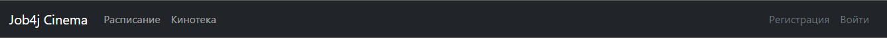
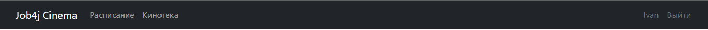
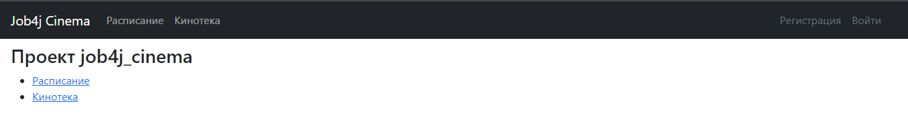
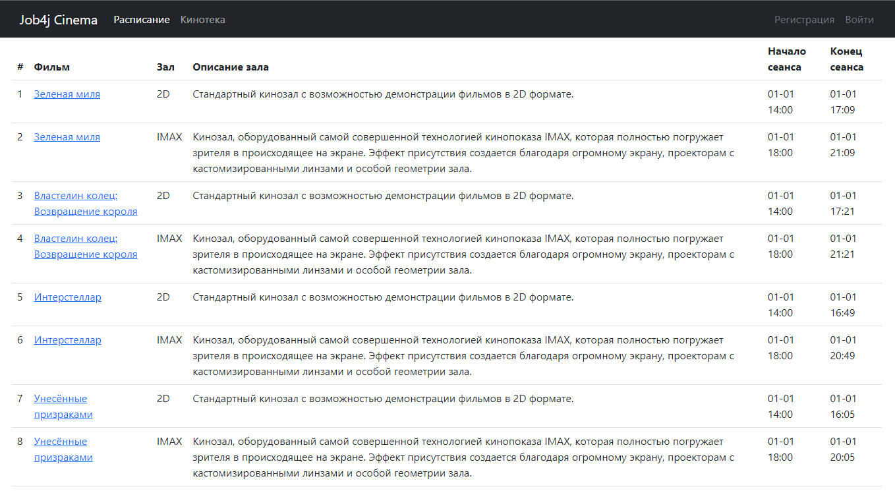
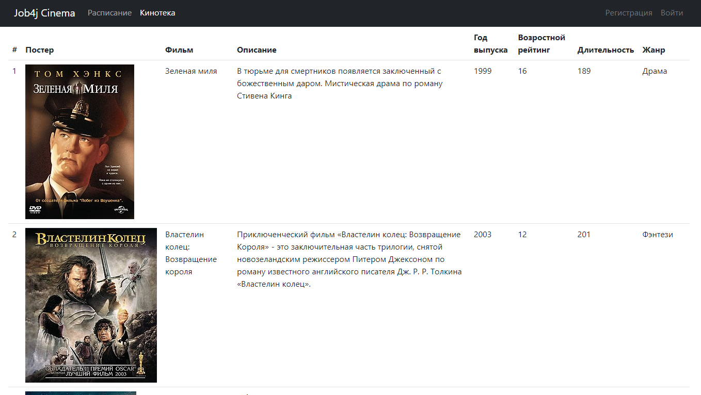
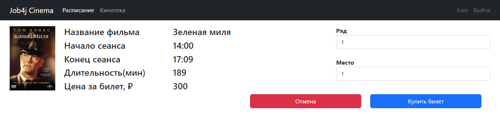
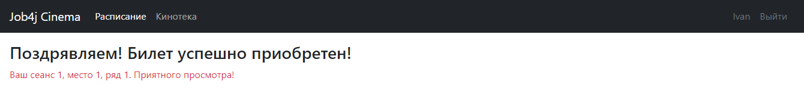
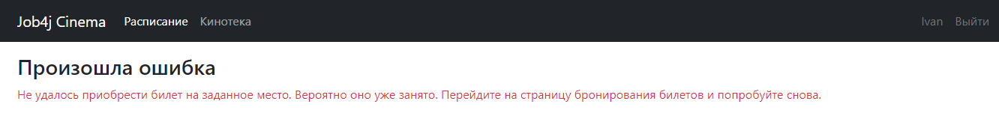
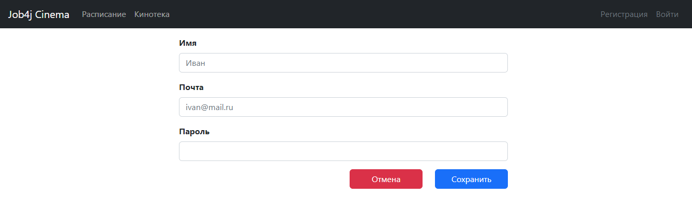
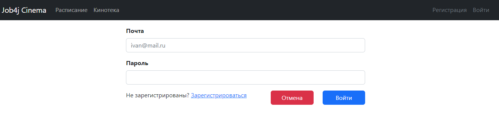

# Job4j Cinema Project

## Contents

- [Description](#description)
- [Build & Run](#build-and-run)
- [Technologies](#technologies)
- [Contacts](#contacts)

## Description
This is an educational project of a cinema website. It only implements the following features: 
- Registration/Login
- Display of film sessions and films 
- Ticket purchase

All users have the right to view information on the website.
Only registered users can purchase tickets. 
If a user is not registered and clicks on the "Buy Ticket" button,
they will be redirected to the login page.
All tables except for the "tickets" and "users" tables are populated using SQL scripts. 
Such data is filled in by the administrator. However, in this project, there is no administrator panel.

### 1 Navigation bar
- Logo: Clicking on it redirects to the main page.
- Schedule: Displays movie sessions and their associated films.
- Movie Library: Displays a list of movies being shown in the cinema.
- Registration/Login: If the user is not logged in.
- Username/Logout: If the user is logged in.

### 2. Main page

### 3. Schedule.
 Display movie sessions and the associated films.When a specific session is selected, 
 the user is redirected to the ticket purchase page

### 4. Movie Library
 Display a list of films

### 5. Ticket Purchase Page.
Display information about the session and film. 
Also, include two drop-down lists - one for selecting the row and another
for selecting the seat, along with "Buy" and "Cancel" buttons

### 6. Successful Ticket Purchase Result Page. 
Display a message to the user

### 7. Unsuccessful Ticket Purchase Result Page (ticket already purchased) 
Display a message to the user

### 8. Registration Page

### 9. Login Page

## Build and Run

### Terminal 

1. Go to the project directory
2. Execute the command: ``mvn liquibase:update``
3. Execute the command: ``mvn clean install``
4. Execute the command: ``mvn spring-boot:run``
5. Go to the following link: ``http://localhost:8080/index`` or ``http://localhost:8080``

### IDE 
1. Download the project
2. Execute the scripts to create and initialize tables from the directory ``db\scripts`` from 001... to 006... 
If necessary, supplement the scripts with the data you need
3. Start the application by executing the ``main()`` method in the ``Main.class(src\main\java\Main.class)`` 
4. Go to the following link: ``http://localhost:8080/index`` or ``http://localhost:8080``

## Technologies
- Java 17
- Maven 4.0
- JUnit 5.8.2
- AssertJ 3.23.1
- Spring boot 2.5.2 
- Thymeleaf 2.5.2 
- Bootstrap 4.4.1 
- Sql2o 1.6.0 
- PostgreSQL 14.1
- Liquibase 3.6.2 
- Log4j 1.2.17
- Mockito 4.0.0 
- H2 1.4

## Contacts

&nbsp;&nbsp;
<a href="mailto:michael.lobov13@gmail.com">
&nbsp;
</a>michael.lobov13@gmail.com